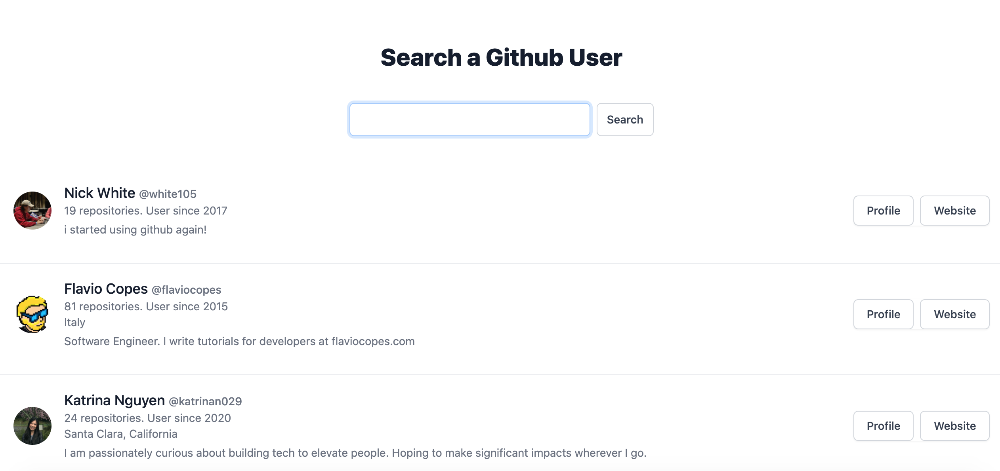

# GitHub User Data API Project

## Introduction
In this project I created an application that uses the GitHub API to show information to the person using it. 

The goal of the application is to:

  * Provide a search form we can use to ask GitHub some data about a specific user
  * If the user enters a specific GitHub username, and hits enter, the application will ask the GitHub API for information about this user.
  * Display the user information on the screen.

## Download app
To get the app up and running, clone the repo, run `browser-sync start --server --files '.'`

